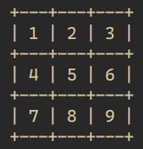

# RUBY PROJECT 3: TIC TAC TOE

In this project, we create a Tic Tac Toe game. The main goal is to put into practice the main concepts of Object Oriented Programming. Particularly, classes and access to their attributes.

  

## TIC TAC TOE GAME INSTRUCTIONS

* Tic Tac Toe is board game played on a board with a 3 squared by 3 squared grid.

* The players are assigned their own symbols to place on the board cells

* Player 1 will be assigned the `X` symbol.

* Player 2 will be assigned the `O` symbol.

* Players take turn to place their symbols on the board.

* The grid is numbered from 1 to 9.

*   

* You place the symbol by choosing the cell number.

* The  First Player to get 3 of her symbols in a row (up, down, across, or diagonally) wins the game.

* When all 9 squares are full, the game is over. If no player has 3 marks in a row, the game ends in a tie.

## Built With
- Ruby

## Getting Started
To get a local copy up and running follow these simple example steps.

### Prerequisites
- Text editor
- GitHub
- Git
- Ruby

### Setup
Clone repository from github to your local drive by following these steps:
- Go to the main page of the repository
- Above the listed files, click the green Code button
- You can clone the repository using:
  - SSH: `git@github.com:SamroodAli/tic-tac-toe.git`.
- Open Terminal
- Change the current working directory to the location you want the cloned directory
- Type one of the git clone commands listed above.
- Press Enter to create your local clone

### Install
- Install Atom or Microsoft Visual Studio text editor to view the code on your local machine.
- Install Git.

## Authors

👤 MARIJAN BRVAR

- GitHub: [@githubhandle](https://github.com/marijanbrvar)
- Twitter: [@twitterhandle](https://twitter.com/marijanbrvar)
- LinkedIn: [LinkedIn](https://linkedin.com/in/marijanbrvar)

👤 SAMROOD ALI

- GitHub: [@SamroodAli](https://github.com/SamroodAli)
- LinkedIn: [Samrood Ali](https://www.linkedin.com/in/samrood-ali/)

> 

## 🤝 Contributing

Contributions, issues, and feature requests are welcome!

Feel free to check the [issues page](https://github.com/amiraabouhadid/project3_tictactoe/issues).

## Show your support

Give a ⭐️ if you like this project!

## 📝 License

- This project is [MIT](https://opensource.org/licenses/MIT) licensed.
- This project is [creativecommons](https://creativecommons.org/licenses/by-nc/4.0/) licensed.
